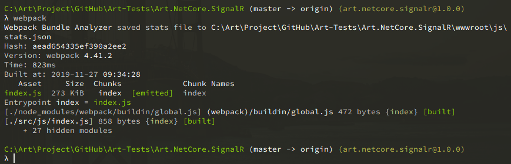

## intro

1. 透過.net Core 3 練習使用 signalR
1. 利用 webpack 編譯前端 js

### 0. 建立.net core 專案

```shell
dotnet new web -o <專案目錄>
```

> 當然也可以透過 VS2019 的介面新增專案


### 1. [前端]加入 signalr 前端套件

```shell
npm i @microsoft/signalr --save
```

如果打算用`<script></script>`載入 signalr 的方式，記得需要手動將`node_modules/@microsoft/signalr/dist/browser/signalr.js`複製到`/wwwroot/lib/signalr/`目錄內

> 其餘使用方法及注意事項請直接參考 NPM 網站說明:[@microsoft/signalr](https://www.npmjs.com/package/@microsoft/signalr)

### 2. [前端]於頁面載入 signalr.js

於頁面加入標籤引用 js 檔案

```html
<script src="lib/signalr/signalr.min.js"></script>
```

### 3. [後端]準備 Hub

.net Core 3 不需要額外安裝 nuget 套件，可直接`using Microsoft.AspNetCore.SignalR;`  
新增一個類別，繼承 Hub，即可開始撰寫 SignalR 的 Hub，範例如下

```csharp
using System;
using System.Collections.Generic;
using System.Linq;
using System.Threading.Tasks;
using Microsoft.AspNetCore.SignalR;

namespace Art.NetCore.SignalR.Hub
{
    public class ChatHub :Microsoft.AspNetCore.SignalR.Hub
    {
        public async Task SendMessage(string user, string message)
        {
            await Clients.All.SendAsync("ReceiveMessage", user, message);
        }
    }
}

```

### 4. [後端]準備注入服務

```csharp
// Startup.cs
public void ConfigureServices(IServiceCollection services)
{
    services.AddSignalR();
}

public void Configure(IApplicationBuilder app, IWebHostEnvironment env)
{
    app.UseEndpoints(endpoints =>
    {
        endpoints.MapHub<ChatHub>("/chatHub");
    });
}

```

### 5. [前端]呼叫 SignalR

```javascript
// 建立SignalR連接
var connection = new signalR.HubConnectionBuilder().withUrl('/chatHub').build();
// 傳送訊息事件
connection.on('ReceiveMessage', (user, message) => appendMessage(`${user}:${message}`));
// 連接事件
connection.start().catch(err => console.error(err.toString()));

// Button事件
document.getElementById('submitBtn').addEventListener('click', function(event) {
	var user = document.getElementById('name').value;
	var message = document.getElementById('msg').value;
	connection.invoke('SendMessage', user, message).catch(err => console.error(err.toString()));
	event.preventDefault();
});

// 在UI上添加訊息
function appendMessage(content) {
	var li = document.createElement('li');
	li.textContent = content;
	document.getElementById('msgDiv').appendChild(li);
}
```

### 6. [前端] 透過 npm 安裝 signalr

```
npm install @microsoft/signalr --save
```

於 js 使用時透過 require 載入，並透過 webpack 編譯

### 7. [前端] 安裝 webpack 及相關套件

這是相關依賴，透過 npm 逐一安裝

```javascript
// package.json
  "devDependencies": {
    "@babel/core": "^7.7.4",
    "babel-loader": "^8.0.6",
    "css-loader": "^3.2.0",
    "style-loader": "^1.0.0",
    "webpack": "^4.41.2",
    "webpack-bundle-analyzer": "^3.6.0",
    "webpack-cli": "^3.3.10"
  }
```

下面的設定是從別的練習專案複製過來的，所以會有 vue 等東西，再將不需要的東西刪除掉即可  
細節設定非本次文章重點，請自行查詢 webpack 相關資料

```javascript
const BundleAnalyzerPlugin = require('webpack-bundle-analyzer').BundleAnalyzerPlugin;
var path = require('path');

module.exports = {
	mode: 'development',
	entry: {
		index: './src/js/index.js',
	},
	output: {
		path: path.resolve(__dirname, 'wwwroot/js'),
		filename: '[name].js',
	},
	module: {
		rules: [
			{
				test: /\.js$/,
				use: 'babel-loader', //使用 babel-loader 來編譯 .js
				exclude: /node_modules/,
			},
			{
				test: /\.css$/,
				use: ['style-loader', 'css-loader'],
			},
		],
	},
	resolve: {
		extensions: ['.js', '.vue'],
	},
	optimization: {
		splitChunks: {
			cacheGroups: {
				common: {
					test: /[\\/]node_modules[\\/]/,
					name: 'common',
					chunks: 'initial',
					priority: 2,
					minChunks: 2,
				},
			},
		},
	},
	plugins: [
		// make sure to include the plugin!
		new BundleAnalyzerPlugin({
			analyzerMode: 'disabled', // 不启动展示打包报告的http服务器
			generateStatsFile: true, // 是否生成stats.json文件
		}),
	],
	// externals: {
	//     jquery: "jQuery"
	// }
};
```

順利完成的話應可以直接透過指令`webpack`完成編譯前端程式的動作


## ref

1. [Homura Lin - [鐵人賽 Day3] 第一個 SingalR 專案](https://homura0731.github.io/post/ironman2019/ironman-day-03/)
